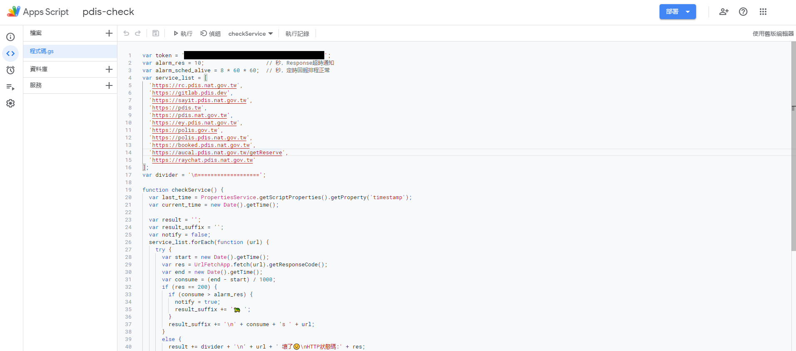

# check-service-notify-line
以 Google Apps Script 定時檢查 PDIS 服務，並以 LINE Notify 推播到 LINE 群組，另外會定時回報排程是否正常運行

## 建置流程
### 1. 註冊 LINE Notify
登入 https://notify-bot.line.me/ ，在右上角進入 `User` -> `My Page` -> `Generate token`

填寫服務名稱，注意名稱之後不能改，然後選擇要推播的群組，送出

複製下來 Token，等等要給 Google Apps Script 使用

完成後畫面如下，如果要註銷 Token，這邊按 `Disconnect`

打開 LINE，會看到有個人 `LINE Notify` 密你，把他加入剛剛指定的群組，就完成 LINE 的設定

### 2. 開通 Google Apps Script
在 Google Drive 建立一個 Apps Script，將 main.gs 內容貼過來，再貼上剛剛的 Token

設定每分鐘檢查一次

每分鐘檢查如果有錯誤，就會推送到群組，每八小時會通知排程正常運行

